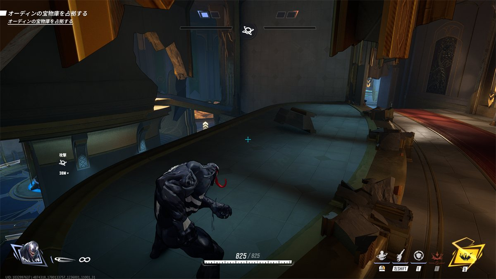
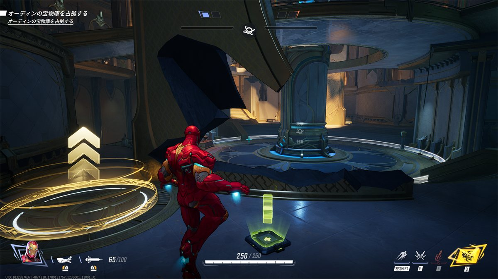
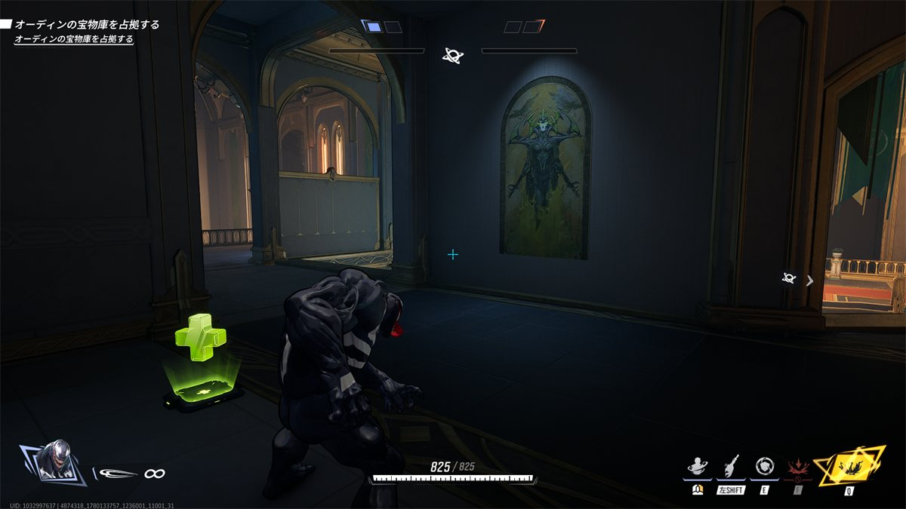
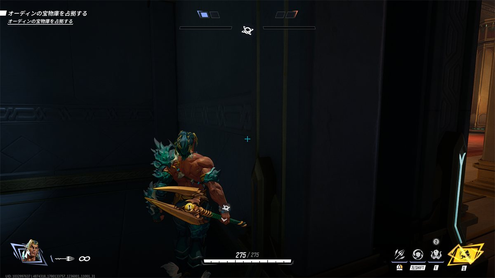
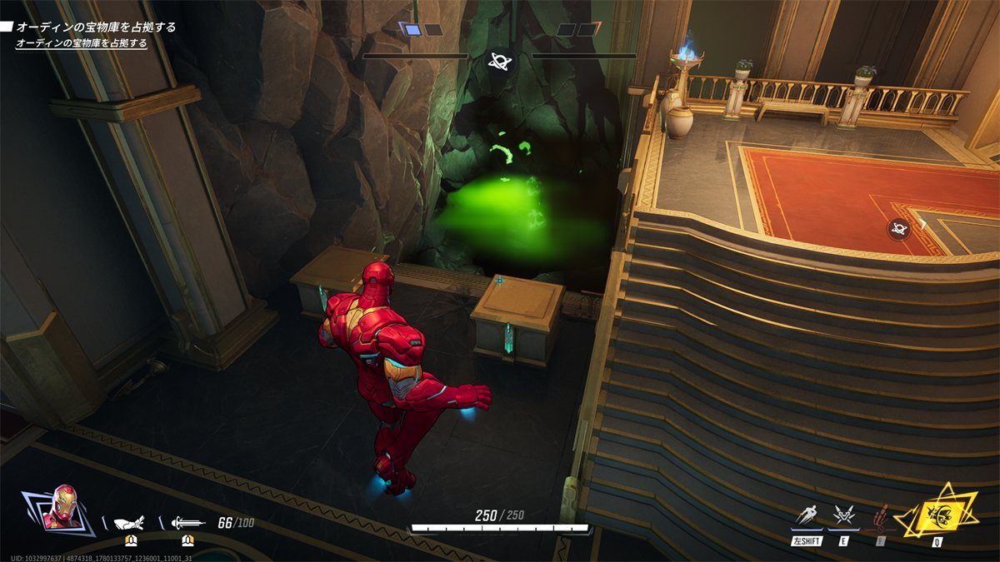

## ステージ全体の特徴

* リスポーンルームから脇の細道は攻め側がしっかりしていないと非常にケアしにくくなっており、ここから逆転が安易に起きうる

* 吹き抜け部分の床にはエリア判定がない。

## 初動ファイト(エリア部屋での立ち回り)

* エリア部屋は吹き抜けになっていて、一見大乱闘部屋に見えるが外周部にエリアを打ち下ろせる高台が存在する。

  ベタ足キャラだと外周の廊下みたいなところから壁を破壊するとエントリーできる。
  * ダイバーフランカーはこの高台を巡回して敵を排除、味方に座らせる。

* 純正タンク
  1Fを道なりに来てジャンプ台+ヘルスパックがあるところ。  
  ここを障害物を破壊してヒール通るようにしつつ、エリア内の敵と相撲する。  
  
  * 高台がクリアになって、エリア取れそうなら全員で前に出る。

## エリア取得後(リスキル)

* 脇出口のコーナー付近、ヘラの絵の前が強そう。

ヘルスパックあり。
エントリーする側からは待ち伏せが見えにくいつくりになってるので、ほぼ先制攻撃になる。  
相手ヒーラーなしの場合、ヘルスパックのそばにいる相手と打ち合いになる。  
* なぜ？  
  ※このゲームではカメラが右側の視界が広い。  
    ヘルスパックと同じX軸から、壁の内側にいながらも通路の視点が一部見える。  
    エントリーする通路側からは、ヘルスパックを視認できない。
  

  * インコースを歩いてくればある程度ケア可能ではあるが初見殺し性高い

## 被エリア取得後(リス地点からの捲り)

* ベーシックに裏どりアプローチ。
  * エリア部屋までのマラソンが結構長いので、全員がエリアを守りに一斉に振り返ったケースではタンクから殺れるだろう。

* リス位置からほど近いところ、低い位置に奈落の毒沼が存在する。  
  ジェフでウルト持ったまま死んでしまい、目の前で風呂敷を広げられた時に正攻法として使ってもいいかも。
  