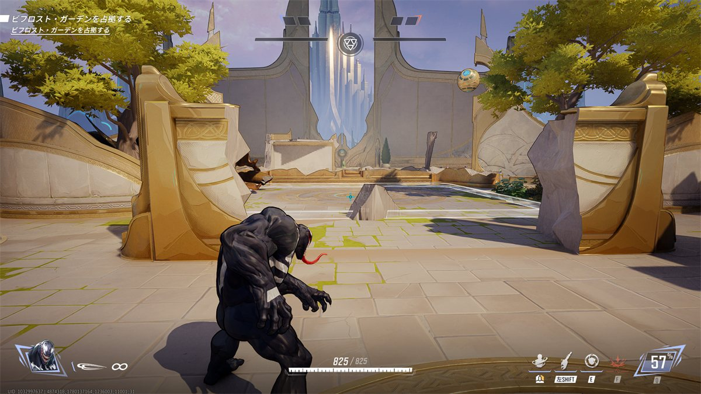
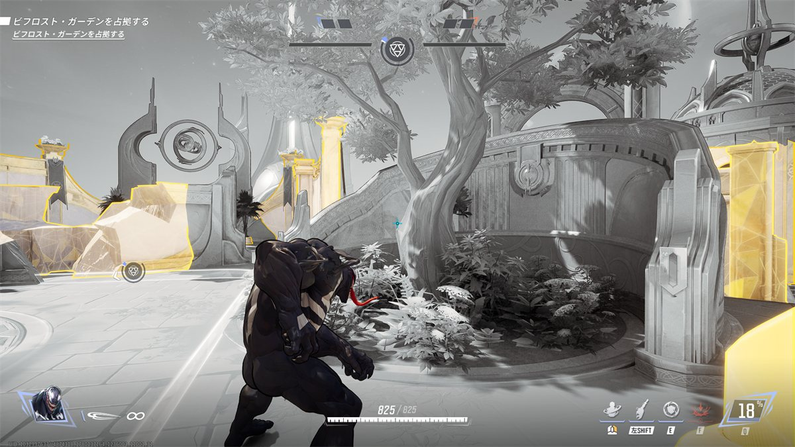
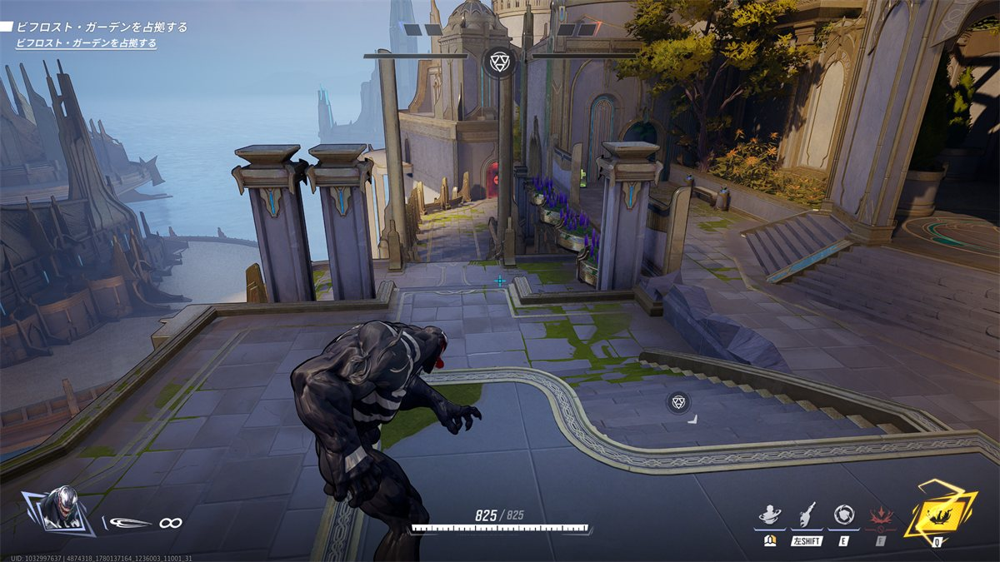
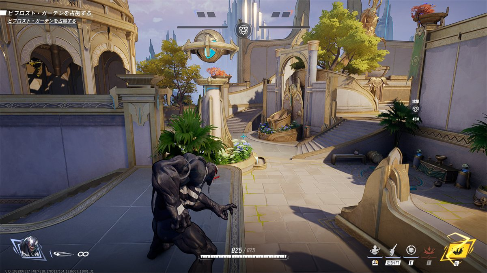

## ステージ全体の特徴

* リス位置からエリア部屋までが非常に近い。  
  ヴェノムで1スイングで到達可能なくらい。  

* リスポーンルームから脇の細道は攻め側がしっかりしていないと非常にケアしにくくなっており、ここから逆転が安易に起きうる

* 高台を取るゲームことMRだが、エリア部屋(ロキ像)の高台がすべて安易に破壊されるつくりになっている。
  * Vericalな撃ち合いよりもHorizontalな撃ち合いや近距離ファイトが得意なやつがグンネス
  * ただし、知らなければムーンナイトとかでぼったくれる可能性はある
  * 破壊後の様子。エリア周りにほぼ高台といえる高台はない。
    

## 初動ファイト(エリア部屋での立ち回り)

* 実質的な戦闘エリアはとても狭い。ロキ像のところに真っ先に向かう。
* 高台(ロキ像のあたり)は見つけ次第粉々にする。

* エリアの脇に生えてる木は破壊不可能でなおかつ壁ラン対応のため、ヴェノムのダイブの起点にできる。
  

## エリア取得後(リスキル)

* メイン戦線は、押してる側が逆に守りにくい地形になってそう。
* デュオはなが～い坂道のてっぺんで裏口を監視する。
  * DPSから打ち下ろしになるのでDPS使うのもよい
    

## 被エリア取得後(リス地点からの捲り)

* ベーシックに裏口からアプローチ。
  * 体感リス位置からエリアまでのマラソンが短めなので、エリアを光らせずに前に来てる敵のサポートを切って全滅させるプランでもいい。
  
  裏口からの坂を上りきったところ。
  右手に行けばエリアだが、(ここまでこれたということは)左側に敵が６人固まっていてサポを暗殺可能。  
  このステージは近接先頭にならざるを得ず逃げ手がないので、エリア内で6V1が発生するのははマズそう。  
  したがってここからの展開はサポートをやっつけるのが正攻法か？