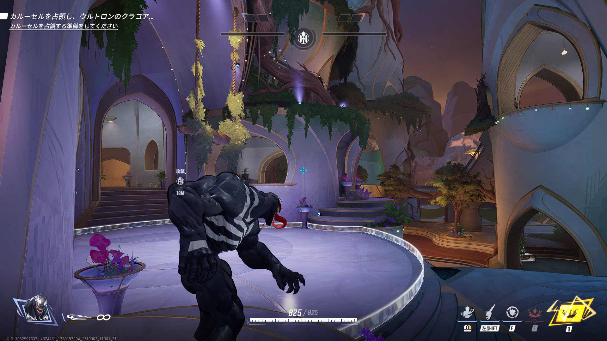

## ステージ全体の特徴

* リスポーンルームの意味なしポータル

* エリア部屋はThe高台みたいなおあつらえ向きの高台がなく、横方向への広がりが多く常に闇討ちが発生する

* リス地点前はだだっ広い庭になっている

* エリア部屋の一番高いところは、安定して強ポジと思われる。
  

## 初動ファイト(エリア部屋での立ち回り)

## エリア取得後(リスキル)

## 被エリア取得後(リス地点からの捲り)

２つ岩があるところがバランスいいかも
