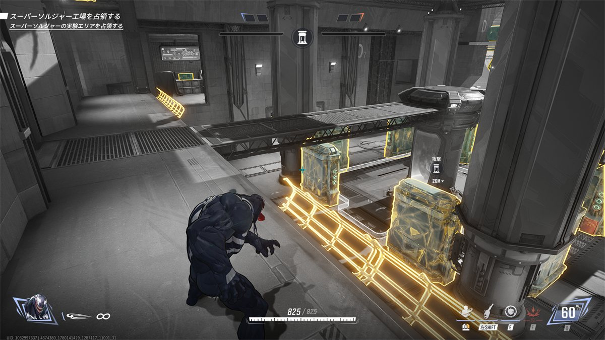
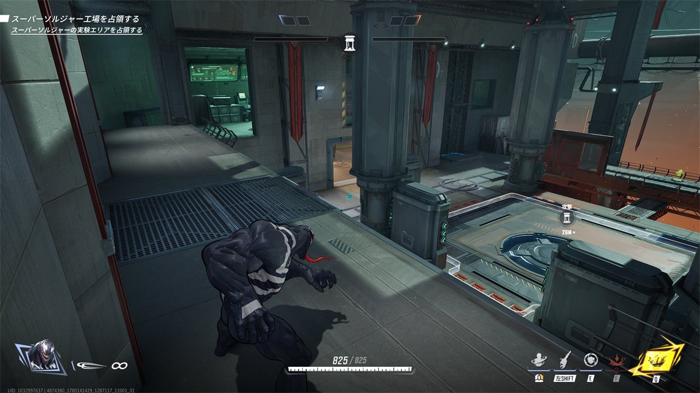
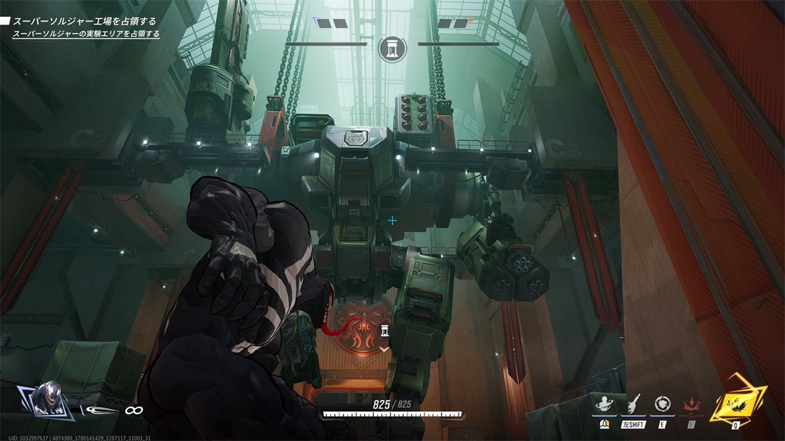
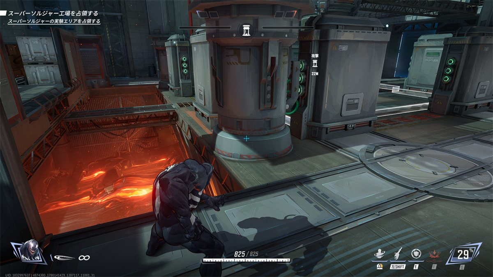

## ステージ全体の特徴

* エリア部屋の高台が破壊されない。  
  
  ここを抑えられるとエリア内で生き残るのがきつくなる。  

* 時間経過とかでステージが回転し地形が変化する
  
  高台のチンコがなくなった。

## 初動ファイト(エリア部屋での立ち回り)

* 開幕、ロボットが挙手している方からエントリーする、
  中央のエリア部屋のひとつ隣の、ヘルスパックのある小さい横部屋  
  
  開幕ロボット この場合は左に行くと高台に出られる。
  * 高台はエリア取りの過程で適宜使用

* マグマの奈落があるので、恐竜でつかんで落とすなどで使えそうなら使ってみる
  

## エリア取得後(リスキル)

* 大勢の味方は、このトンネルのところからpokeしようとすると考えている。  
  
  * 脇道が二つもあって難しいから適当にやる

## 被エリア取得後(リス地点からの捲り)

* 裏どりからエリアを光らせて戻す。
  * エリアの四隅の柱に隠れると、防衛側から完全に隠れられる。  
    （光らせ始めたことに気づくのが数秒遅れた場合、奪還して時間稼げる程度）
