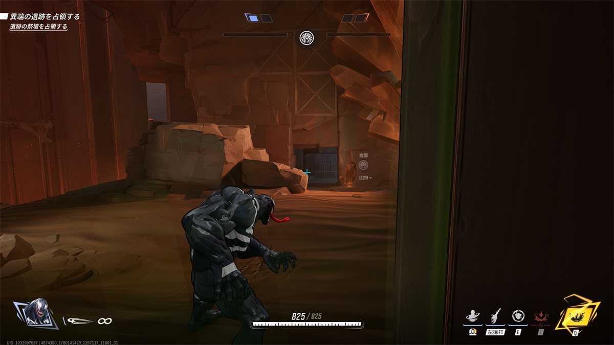
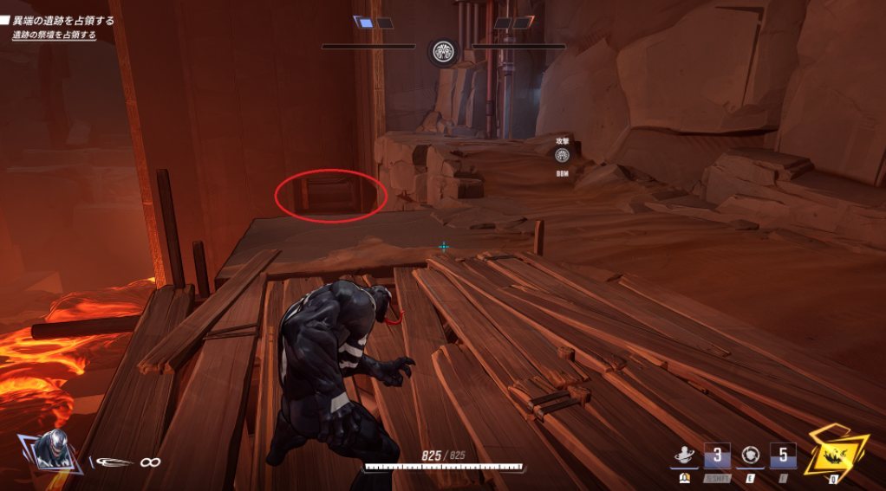
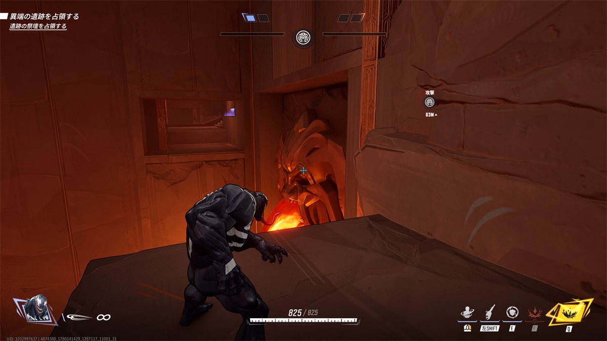
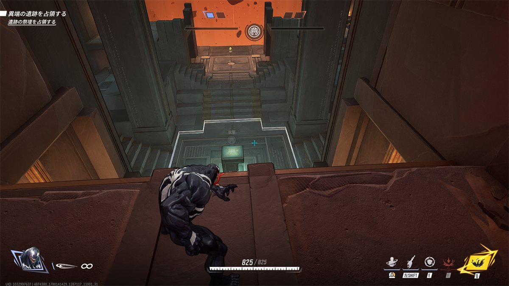
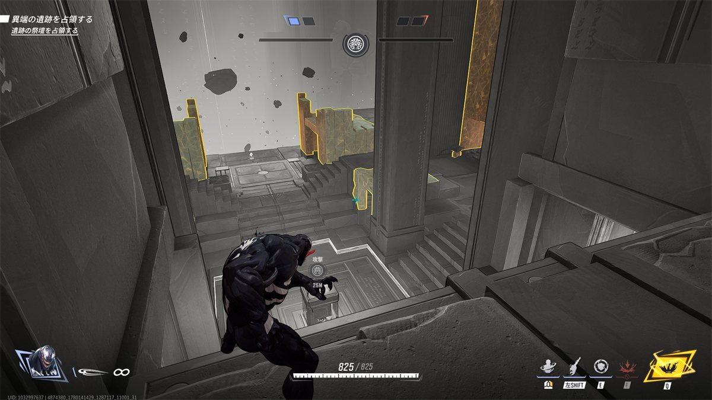
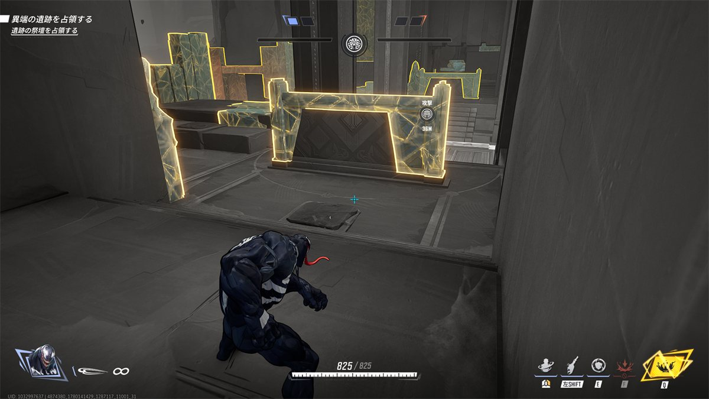
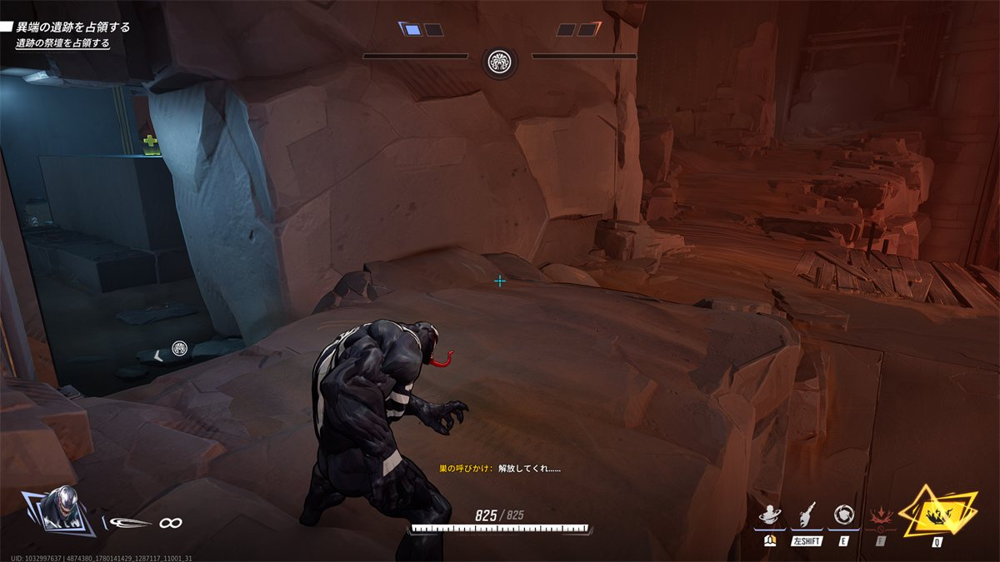

## ステージ全体の特徴

* エリア部屋までのマラソン距離がとても長い。

* べた足キャラでは不可能だが高台にアクセス可能な抜け道が存在する。
  
  開始位置から向かって左へ行くと、それはある。
  
  谷になっており、壁走りやBlinkスキルが必要。
  
  行った先のジャンプ台からこんな高台へ最短アクセスできる。
  （一応、エリア側からも下を回ればアクセスできる）
  
  * エリア部屋の小高台は壊れてしまうので、なるべくムーンナイトなどの強い砲台をここからフリーディールさせたい。
    

## 初動ファイト(エリア部屋での立ち回り)

* 最初に述べた高台を死守する、あるいは相手に利用させない

* 正攻法で攻める際は、クリアできていない状況でタンクがエリア内に安易にはいらないようにする。
  板が邪魔でサポートとの連携がとりにくくなる。  
  

* マグマの奈落があるので、恐竜でつかんで落とすなどで使えそうなら使ってみる
  

## エリア取得後(リスキル)

* 高台に抜ける裏口のところに鎮座し、たまに横穴から味方の支援をする。
  

## 被エリア取得後(リス地点からの捲り)

* 裏どりからエリアを光らせて戻す。
  * ヴェノムの場合はワカンダのステラスペースポートのように、エリア内の壁を使って逃げ回る。
