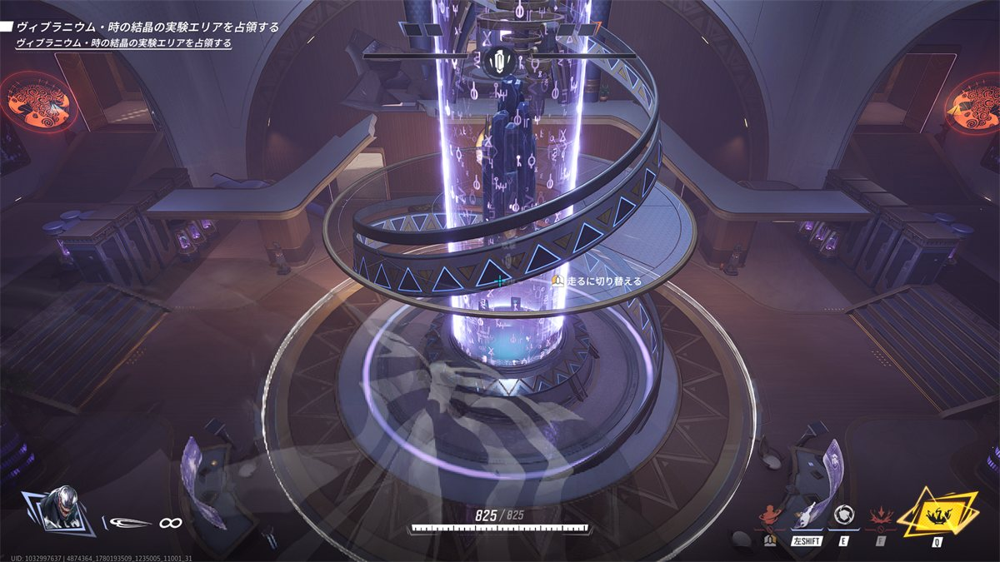
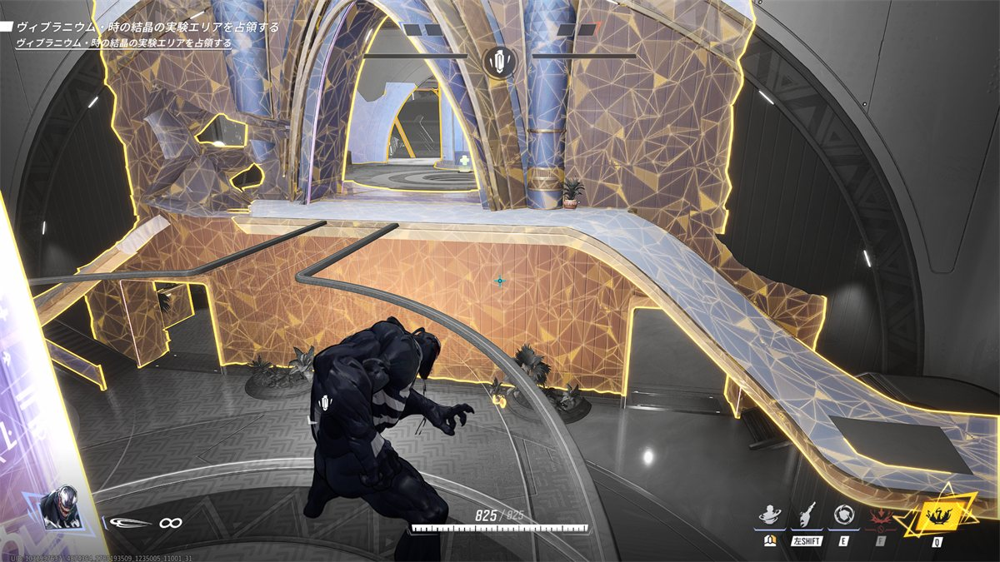

## ステージ全体の特徴

* 中央に一見強力な高台が存在する。  
  
  しかし、ありえないくらいぶっこわれる。
  
  破壊後はやや使いづらくなり、スロープができる。
  

* 拠点からの脇道が2通り出ており、完全な対処は難しい。
  * 裏口も多ければその先の分岐も多い。  
    収束するのがエリア付近のため、前線を上げすぎないことが大事かも

* 高台直結の部屋(トルソー部屋と呼ぶ)
  

## 初動ファイト(エリア部屋での立ち回り)

* 高台周りのトルソー部屋を巡回し、クリア出来たらエリアを制圧していく。

## エリア取得後(リスキル)

* 裏どりからはいろいろ分岐しているが、ブラックパンサーのトルソーの部屋でおおむね合流する。  
  * デュオの片割れがヴェノムを使っているケースでは、裏どりファイターとの1on1ではかなり有利なので裏どりを一人でケアする。
  * 前線の味方は6v5になるがもともと実家前でライフ差不利なので基本的なpokeを徹底してもらい頑張ってもらう(厳しそう)。

## 被エリア取得後(リス地点からの捲り)

* 裏どりからエリアを光らせて戻す。
  * ヴェノムの場合は破壊不可能の壁裏に隠れ、敵が来たらスイングで逃げ + 壁走り
    
    追跡力の高いスターロードなどが来る可能性があるので、  
    スイングからシームレスに別部屋に逃げていくスイングコントロールはあらかじめ勉強しておく。
    ヒョウの像の顔面にスイングくっつけて壁走りで逃げるのがやりやすいと感じた。