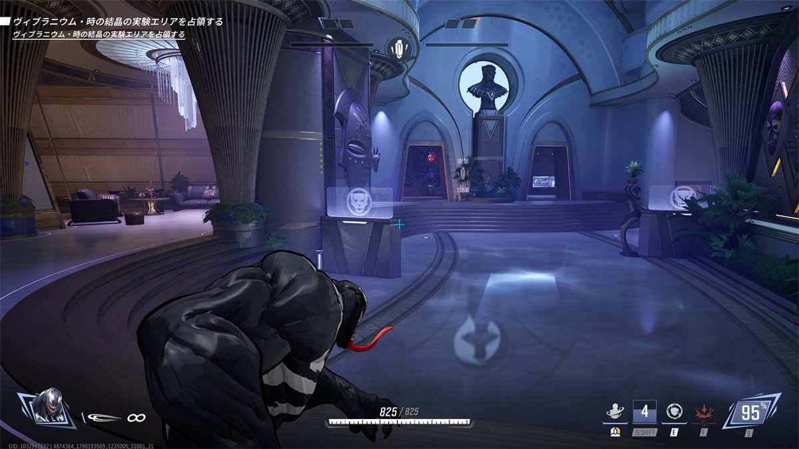
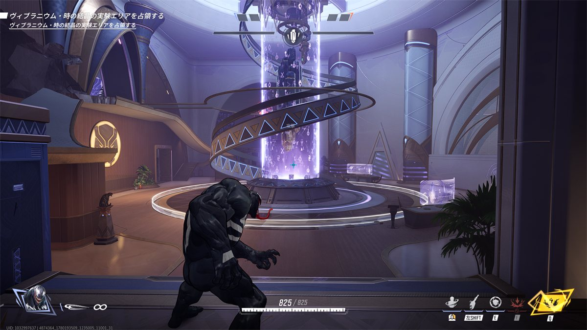

## ステージ全体の特徴

* 天井が低い
* 中央のエリア部分の象牙みたいな柱は壊すとスロープになり、高台アクセスしやすくなる。
  味方に砲台系のキャラがいる場合は優先破壊、謎ダイバーばっかりの場合は無視するでいいと思われる。
  
  
  スロープを使わない場合はここのクソわかりにくいジャンプ台を使用してアクセスする。    
  

* 拠点からの脇道が2通り出ており、完全な対処は難しい。
  * 裏口も多ければその先の分岐も多い。  
    収束するのがエリア付近のため、前線を上げすぎないことが大事かも

## 初動ファイト(エリア部屋での立ち回り)

* 吹き抜け部分の高台を優先して取りに行く。
  * LowEloでは、エリア内にとどまって戦おうとする傾向にあるため  
    高台からリスやムーンナイト、アイアンマンといった爆風砲台系がフリーディールすると一瞬で崩壊する  
    

* タンク不在の場合はわからん

## エリア取得後(リスキル)

* 大勢の味方は、このトンネルのところからpokeしようとすると考えている。  
  
  * 脇道が二つもあって難しいから適当にやる

## 被エリア取得後(リス地点からの捲り)

* 裏どりからエリアを光らせて戻す。
  * エリアの四隅の柱に隠れると、防衛側から完全に隠れられる。  
    （光らせ始めたことに気づくのが数秒遅れた場合、奪還して時間稼げる程度）
